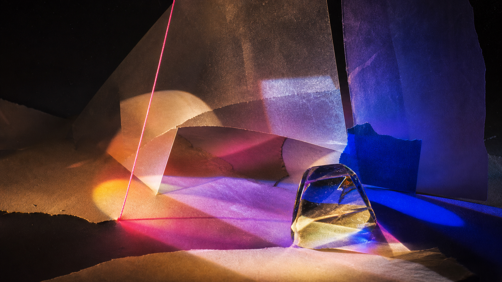
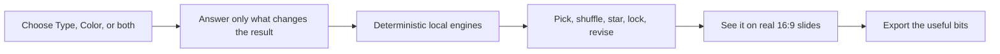

# Letters & Light

**Make it clear. Then make it felt.**

Letters & Light is a local-first type and color direction studio for presentation makers. Find a typographic voice, pull a working palette from one image, or bring both together on real 16:9 slide layouts.

[Open the live tool](https://letters-and-light.dog-pitch.chatgpt.site) · [Read the product guide](docs/PRODUCT.md) · [See how it works](docs/ARCHITECTURE.md)



No account. No upload server. No runtime AI. No analytics quietly watching over your shoulder. The work happens in your browser; your image pixels stay there.

## Three ways in

| Route | Use it when | What leaves the studio |
|---|---|---|
| **Type** | The deck needs a clearer voice and reading hierarchy. | Five distinct directions, exact browser fonts, editable specimens, sources and caveats. |
| **Color** | One image should become a usable visual world. | Essential colors first, complete role system second, contrast truth, alternates and exports. |
| **Full look** | Type and color both need attention. | Two sovereign recommendations composed into one direction—without either engine inventing evidence for the other. |

Short routes stay short. People who want a longer ride can choose one; the tool never turns curiosity into compulsory admin.

## What makes this different

- **64 real open-font families.** Every preview uses the exact self-hosted WOFF2 file it names. Each family keeps its designer, OFL license, source and file hashes attached.
- **Deterministic recommendations.** The same answers and source pixels produce the same result. Shuffle is explicit. Corrections are reversible.
- **Slides that look like slides.** Five 16:9 jobs, bounded editable copy, visible fit checks and no vague rectangles pretending to be presentation design.
- **Useful complexity, tucked away.** The first result is readable. Evidence, source maps, complete roles and developer exports appear when asked for.
- **Honest boundaries.** Browser rendering is not presented as proof of PowerPoint, Keynote, Google Slides, PDF round-trips or another person’s machine.



## Run it locally

Requirements: Node.js 22.13 or newer.

```sh
git clone https://github.com/bomkino/letters-and-light.git
cd letters-and-light
npm ci
npm run dev
```

The development URL is printed in the terminal. The app needs no API keys, database or third-party runtime service.

## Check the whole thing

```sh
npm run check
```

That command validates the public release boundary, all 64 font licenses and 248 file hashes, the deterministic core, frontend behavior, TypeScript, the production build and the deployable Sites artifact.

Useful narrower commands:

```sh
npm run core:test
npm run web:test
npm run type-library:validate
npm run build
```

## Repository map

| Path | Job |
|---|---|
| `src/core/` | Deterministic type, color, harmony and export logic. |
| `src/contracts/` | Public schemas and versioned product contracts. |
| `data/type-library/` | Curated font policy and exact acquisition lock. |
| `data/legacy/` | Preserved Type Set and Color, Please evidence; candidates stay candidates. |
| `web/src/` | The interface, image worker, slide lab and export surface. |
| `public/fonts/` | Self-hosted OFL files, one license beside every family. |
| `app/`, `worker/` | Thin Vinext/Cloudflare adapter used for the public site. |
| `tests/`, `web/test/` | Core and interface proof. |

## Privacy

Uploaded images are decoded and sampled in the browser. The original image, original filename and working pixels are not placed in saved project JSON. Persistence is opt-in and local. Read the exact boundary in [docs/PRIVACY.md](docs/PRIVACY.md).

## Contributing

Good bug reports, awkward images, accessibility findings, font evidence and sharply argued design improvements are welcome. Start with [CONTRIBUTING.md](CONTRIBUTING.md). No contributor license agreement; contributions arrive under the same license they leave with.

## Licenses

Project-authored code, copy, documentation, data and non-brand artwork use the [MIT License](LICENSE). The 64 font families remain under their adjacent SIL Open Font License 1.1 files. pitch.dog names and marks are not relicensed. [LICENSES.md](LICENSES.md) explains the seams without legal soup.

Built with unreasonable care by [pitch.dog](https://pitch.dog).
