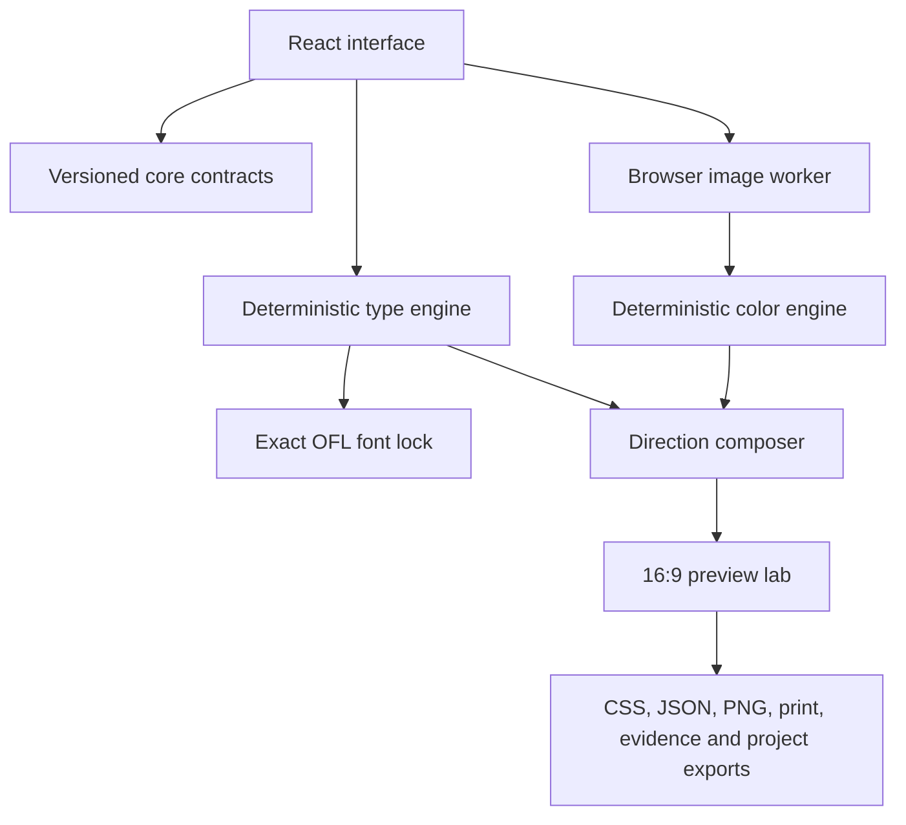

# Architecture

The product is static at runtime and split by responsibility.

## Core

`src/core/` owns recommendation, color-space work, contrast, harmony, project serialization and exports. It has no browser dependency and no network primitive. `tests/` exercises deterministic results, schema boundaries, malicious copy, correction history and export safety.

`src/contracts/` and `src/domain.ts` define the versioned boundary consumed by the interface. A UI change should not quietly mutate those contracts.

## Type library

`data/type-library/curation.v1.json` is the human-reviewed policy. `font-library.lock.json` is the generated acquisition record. The lock identifies 64 families and 248 exact WOFF2 resources with designer, upstream source, license, byte count and SHA-256.

The browser uses only `/public/fonts/type-library/`. No Google Fonts stylesheet or remote runtime request is involved.

## Color pipeline

The browser decodes an image, normalizes it to a bounded working surface and passes pixels to `web/src/image/colourWorker.ts`. The worker returns inspectable sample and cluster evidence. The core turns that evidence into role-based systems and checks light and dark companions independently.

Image bytes and pixels stay in memory. Saved projects retain the working-pixel hash and design decisions, not the source image.

## Interface state

`web/src/app/store.tsx` owns one immutable reducer. Engine outputs remain evidence; UI edits are explicit operations with undo and redo. The hash router stores only route names. User answers and project data never enter the URL.

## Hosting adapter

The authored interface remains in `web/src/`. `app/` is a thin client-only Vinext entry, and `worker/` is the Cloudflare-compatible server shell required by Sites. It adds hosting, not a product backend.

## Release invariants

- no runtime AI, API, analytics, database, account or email gate;
- no remote font request;
- no silent promotion of legacy candidate evidence;
- no shared composer mutation of type or color evidence;
- no saved image pixels or original filename;
- no claim that browser proof equals PowerPoint, Keynote or Google Slides proof.
